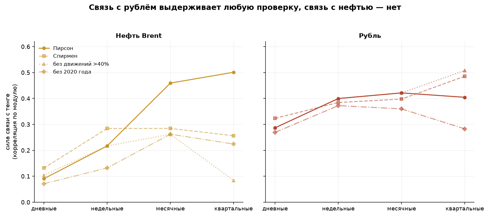
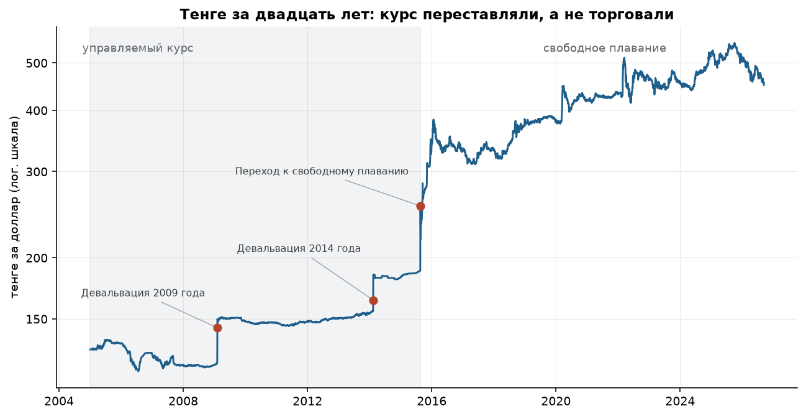

# С кем ходит тенге?

Анализ официальных курсов валют Национального Банка РК: полный цикл
от загрузки сырых данных до выводов.

**Вопрос:** про курс тенге в Казахстане одновременно говорят «он идёт
за рублём» и «он идёт за нефтью». Обе версии звучат уверенно и обычно
остаются без цифры. Здесь они проверены на открытых данных — и обе
оказались верны наполовину.

**Данные:** официальные курсы Нацбанка РК (два разных эндпоинта, 2005 —
сентябрь 2026, 222 тысячи строк) плюс дневная цена Brent из открытой базы
FRED — единственный источник не из Казахстана.

---

## Главное

**1. Ближайший попутчик тенге — рубль, но связь слабее, чем принято думать.**
Корреляция дневных доходностей 0,32 против 0,15 у следующей валюты. При этом
рубль объясняет всего 10% дневной дисперсии тенге, а восемь ближайших
кандидатов вместе — 13%.

**2. Связь с рублём не постоянная, а хвостовая.** В дни, когда рубль
двигается меньше чем на 0,5%, корреляция 0,06 — её просто нет. В дни, когда
рубль ходит больше чем на 2%, корреляция 0,55. Тенге игнорирует рубль
ровно до начала паники.


**3. Спор «рубль или нефть» решается горизонтом — но не поровну.** На дневных
данных нефть почти не видна (−0,09), на квартальных обгоняет рубль
(−0,50 против +0,40). Красивый ответ — но он не выдерживает проверки:
квартальные −0,50 превращаются в −0,26 по рангам и в −0,08 после удаления
кварталов с обвалом нефти. Связь с рублём при тех же проверках не меняется
вообще.



**4. Плавающий курс не ослабил связи, а создал их.** До августа 2015 года
тенге не коррелировал ни с нефтью, ни с рублём ни на одном горизонте.
Каждый седьмой день курс не менялся вообще ни на тиын, а волатильность без
трёх дней девальваций составляла 2,8% годовых.



**5. Три дня из 5333 дают 47% всего ослабления тенге за двадцать лет.**
Февраль 2009, февраль 2014 и 20 августа 2015. Десять дней дают 81%.

**6. Тенге чаще крепнет, чем слабеет** — доля дней ослабления 49,4%,
асимметрия +1,34. Риск сосредоточен в единичных днях, а не размазан по году.

**7. Примета про налоговую неделю не подтверждается.** Перестановочный тест
на разницу средних между 20–25 числами и остальными днями: p-value 0,999.

**8. Юань почти ни при чём** — 0,085 и нулевой вклад в объяснённую дисперсию,
несмотря на то что Китай крупнейший торговый партнёр.

Подробный разбор со всеми оговорками — **[reports/findings.md](reports/findings.md)**.
Ход разведки — **[notebooks/01_eda.ipynb](notebooks/01_eda.ipynb)** и
**[notebooks/02_oil_and_regimes.ipynb](notebooks/02_oil_and_regimes.ipynb)**.

---

## Что оказалось самым сложным — не анализ, а данные

1. **Кратность котировки, которая менялась.** Драм котируется за 10 штук,
   узбекский сум — за 100. Причём тот же сум в 2013 году публиковался
   за 1 единицу, а к 2016-му — уже за 100. Делить приходится построчно.
2. **Половина дней — не торговые.** В выходные и праздники курс просто
   повторяется. Праздники в РК плавают, поэтому такие дни отлавливаются
   по признаку «нулевое изменение сразу по всем валютам», а не по календарю.
3. **Строки-заглушки.** На даты вне архива сервис отдаёт не ошибку,
   а сегодняшний снимок курсов — внешне неотличимый от настоящих данных.
4. **Дата курса — не дата торгов.** Курс, объявленный на дату D, посчитан
   по торгам дня D−1. Видно это по тому, что за двадцать лет понедельник
   менялся 17 раз, а суббота — 1067. Без поправки выравнивание с нефтью
   уехало бы на целый день — а именно на этом дне вся нефтяная связь
   и держится.

---

## Структура

```
src/
  config.py            пути, группы валют, id формы выгрузки, даты режимов
  fetch_nbk.py         широкая выборка: 48 валют с мая 2021
  fetch_nbk_archive.py длинный ряд: 21 валюта с 2005 года
  fetch_brent.py       дневная цена Brent
  clean.py             типы, кратность, неторговые дни, заглушки
  features.py          база USD, лог-доходности, режимы, горизонты
  analysis.py          корреляции, лаги, МНК, ранги, перестановочный тест
  plots.py             пятнадцать графиков отчёта
  pipeline.py          оба прогона одной командой
notebooks/
  01_eda.ipynb              разведка широкой выборки
  02_oil_and_regimes.ipynb  нефть, горизонты и две эпохи
reports/
  findings.md          выводы
  figures/             графики
  tables/              промежуточные таблицы
  summary.json         ключевые цифры широкой выборки
  summary_long.json    ключевые цифры длинного ряда
data/
  raw/                 сырые строки как пришли из источников
  processed/           чистые таблицы курсов
tests/                 31 тест на очистку, признаки и аналитику
```

## Запуск

```bash
python -m venv .venv && source .venv/bin/activate
pip install -r requirements.txt

python -m src.fetch_nbk                        # ~5 минут, дальше из кэша
python -m src.fetch_nbk_archive                # длинный ряд
python -m src.fetch_brent --start 2004-06-01

python -m src.pipeline                         # таблицы, графики, summary
pytest -q
```

Сырые данные уже лежат в `data/raw/`, так что шаги загрузки можно пропустить
и сразу запустить `python -m src.pipeline`. Отдельные части считаются
через `--only short` и `--only long`.

## Метод, если коротко

Нацбанк котирует всё в тенге, поэтому сравнивать пары напрямую нельзя:
в каждой уже сидит сам тенге, и связь возникнет из-за общего знаменателя.
Все курсы пересчитываются в базу доллара:

```
X за 1 USD = (KZT за 1 USD) / (KZT за 1 X)
```

Дальше — логарифмические доходности (плюс = валюта ослабла к доллару)
на четырёх горизонтах, корреляции, МНК с пошаговым отбором, перестановочные
тесты вместо t-теста (хвосты у валютных доходностей слишком толстые)
и ранговая корреляция как проверка на устойчивость.

## Оговорки

Официальный курс — средневзвешенная утренней сессии KASE, а не биржевой курс
в реальном времени. Квартальных наблюдений после перехода к плаванию всего 44,
поэтому нефтяные выводы проверены четырьмя способами, а не одним. Brent —
прокси для казахстанской экспортной корзины, но не она сама. Корреляция
не доказывает причинность: тенге и рубль могут двигаться вместе не потому,
что один тянет другой, а потому что оба реагируют на нефть и на общий
аппетит к риску.

## Источники данных

Национальный Банк Республики Казахстан — официальные курсы валют.
FRED (Federal Reserve Bank of St. Louis), серия DCOILBRENTEU — цена Brent.
Данные открытые, используются в учебных целях.
