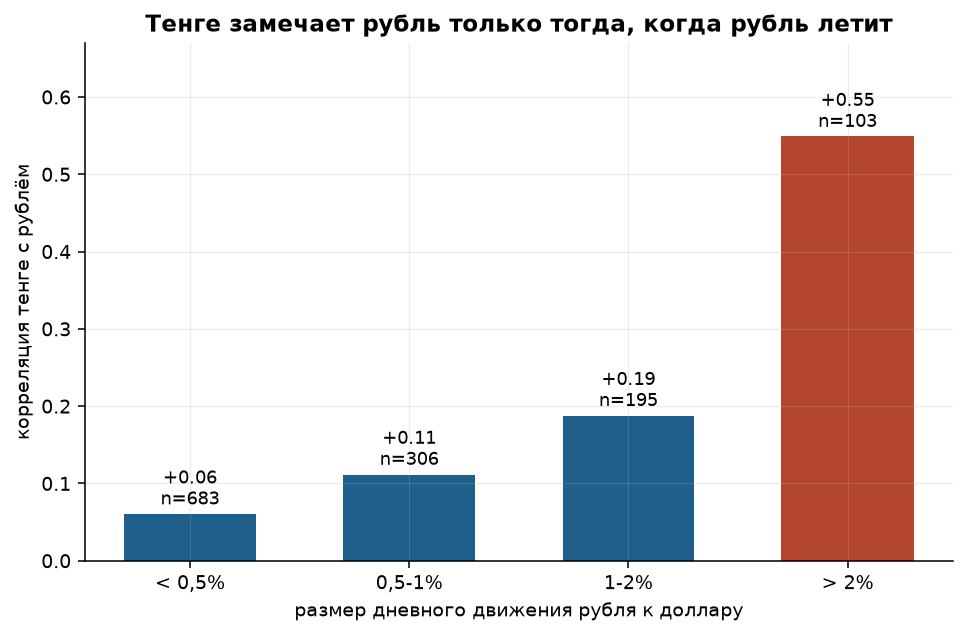
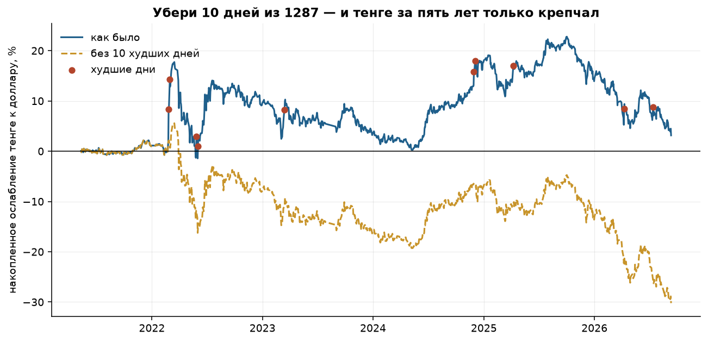

# С кем ходит тенге?

Анализ официальных курсов валют Национального Банка РК: полный цикл от
загрузки сырых данных до выводов.

**Вопрос:** про курс тенге в Казахстане одновременно говорят «он идёт за рублём»
и «он идёт за нефтью». Нацбанк каждый рабочий день публикует официальный курс
сразу к 47 валютам — значит, обе версии можно проверить на его же данных.
С кем тенге действительно двигается в одну ногу, насколько сильно и всегда ли?

**Данные:** открытый эндпоинт официальных курсов Национального Банка РК,
8 мая 2021 — 11 сентября 2026, 1295 торговых дней, 48 валют, 75 561 сырая строка.

---

## Главное

**1. Ближайший попутчик тенге — рубль, но связь слабее, чем принято думать.**
Корреляция дневных доходностей 0,32 против 0,15 у следующей валюты. При этом
рубль объясняет всего 10% дневной дисперсии тенге, а восемь ближайших
кандидатов вместе — 13%. Остальные 87% движений — внутренняя история.

**2. Связь с рублём не постоянная, а хвостовая.** В дни, когда рубль двигается
меньше чем на 0,5%, корреляция 0,06 — её просто нет. В дни, когда рубль ходит
больше чем на 2%, корреляция 0,55. Тенге игнорирует рубль ровно до начала паники.



**3. Юань почти ни при чём.** Китай — крупнейший торговый партнёр, но юань
одиннадцатый в рейтинге с корреляцией 0,085 и нулевым вкладом в объяснённую
дисперсию.

**4. Тенге чаще крепнет, чем слабеет** — доля дней ослабления 49,4%. Но десять
худших дней из 1287 дают ослабление в десять раз больше, чем весь пятилетний
итог. Без них тенге за период не ослаб, а укрепился на 30%.



**5. Примета про налоговую неделю не подтверждается.** Перестановочный тест
на разницу средних между 20–25 числами и остальными днями: p-value 0,999.

Подробный разбор со всеми оговорками — **[reports/findings.md](reports/findings.md)**.
Ход разведки данных — **[notebooks/01_eda.ipynb](notebooks/01_eda.ipynb)**.

---

## Что оказалось самым сложным — не анализ, а данные

Четыре вещи, без которых результат был бы неправильным:

1. **Кратность котировки.** Драм котируется за 10 штук, узбекский сум — за 100,
   донг — за 1000. Без нормировки сум «дороже» евро.
2. **Половина дней — не торговые.** В выходные и праздники курс просто
   повторяется. Праздники в РК плавают, поэтому такие дни отлавливаются
   по признаку «нулевое изменение сразу по всем валютам», а не по календарю.
3. **Строки-заглушки.** На даты вне архива сервис отдаёт не ошибку, а
   сегодняшний снимок курсов — внешне неотличимый от настоящих данных.
4. **Дата курса — не дата торгов.** Курс, объявленный на дату D, посчитан
   по торгам дня D−1. Видно это по тому, что понедельник за пять лет менялся
   ровно один раз, а суббота — 259 раз. Без поправки все календарные выводы
   считались бы не по тем дням.

---

## Структура

```
src/
  config.py       пути, группы валют, даты событий
  fetch_nbk.py    загрузка с кэшем на диск и ретраями
  clean.py        типы, кратность, неторговые дни, заглушки
  features.py     пересчёт в базу USD, лог-доходности, календарь
  analysis.py     корреляции, лаги, МНК, асимметрия, перестановочный тест
  plots.py        девять графиков отчёта
  pipeline.py     полный прогон одной командой
notebooks/
  01_eda.ipynb    разведка данных
reports/
  findings.md     выводы
  figures/        графики
  tables/         промежуточные таблицы
  summary.json    ключевые цифры
data/
  raw/            сырые строки как пришли из источника
  processed/      чистая таблица курсов
tests/            21 тест на очистку, признаки и аналитику
```

## Запуск

```bash
python -m venv .venv && source .venv/bin/activate
pip install -r requirements.txt

python -m src.fetch_nbk      # ~5 минут; повторные запуски идут из кэша
python -m src.pipeline       # таблицы, графики, summary.json
pytest -q
```

Сырые данные уже лежат в `data/raw/`, так что шаг загрузки можно пропустить
и сразу запустить `python -m src.pipeline`.

## Метод, если коротко

Нацбанк котирует всё в тенге, поэтому сравнивать пары напрямую нельзя:
в каждой уже сидит сам тенге, и связь возникнет из-за общего знаменателя.
Все курсы пересчитываются в базу доллара:

```
X за 1 USD = (KZT за 1 USD) / (KZT за 1 X)
```

Дальше — логарифмические дневные доходности (плюс = валюта ослабла к доллару),
корреляции, МНК с пошаговым отбором и перестановочные тесты вместо t-теста,
потому что хвосты у валютных доходностей слишком толстые.

## Оговорки

Официальный курс — средневзвешенная утренней сессии KASE, а не биржевой курс
в реальном времени. Глубина архива чуть больше пяти лет, девальвации 2014 и 2015
годов в выборку не попали. Корреляция не доказывает причинность: тенге и рубль
могут двигаться вместе не потому, что один тянет другой, а потому что оба
реагируют на нефть и на общий аппетит к риску.

## Источник данных

Национальный Банк Республики Казахстан, официальные курсы валют.
Данные открытые, используются в учебных целях.
