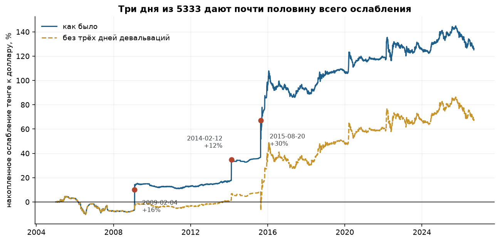
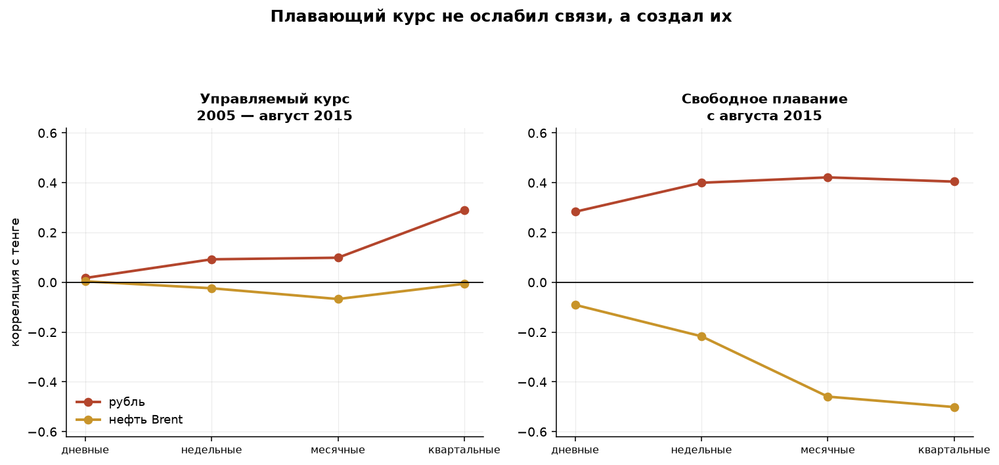
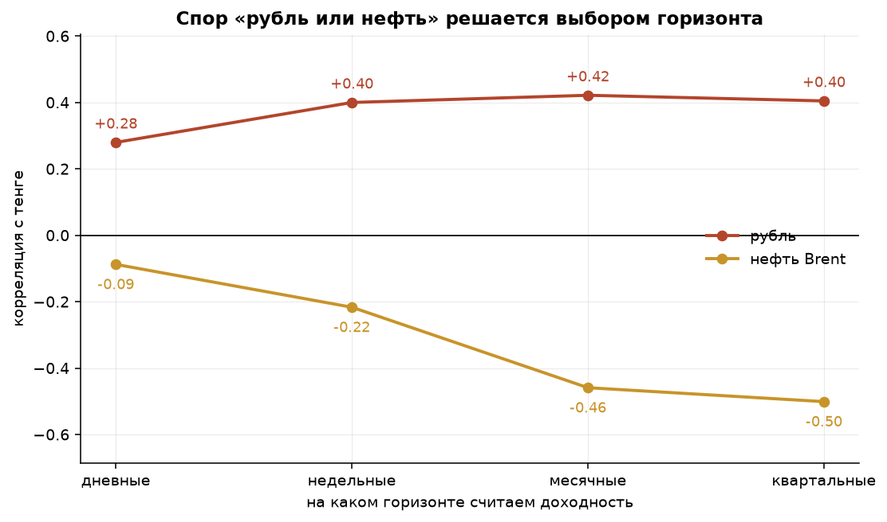
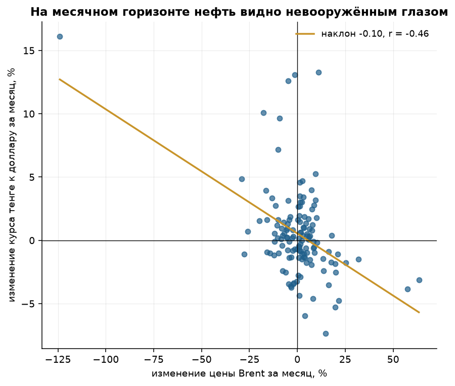

# С кем ходит тенге

Разбор официальных курсов Национального Банка РК. Две выборки: широкая
(48 валют, май 2021 — сентябрь 2026) и длинная (15 валют плюс нефть,
2005 — сентябрь 2026).

---

## Вопросы

Про курс тенге в Казахстане говорят двумя способами сразу: «тенге идёт
за рублём» и «тенге идёт за нефтью». Обе версии звучат одинаково уверенно,
обе обычно остаются без цифры.

1. С какой валютой тенге действительно двигается в одну ногу, насколько
   сильно и всегда ли?
2. Нефть или рубль — и можно ли вообще так ставить вопрос?
3. Что изменил переход к свободному плаванию в августе 2015 года?

Побочно проверяются ещё две вещи: правда ли тенге падает резче, чем растёт,
и работает ли примета про «налоговую неделю».

---

## Данные

| Источник | Что даёт | Период |
|---|---|---|
| XML-эндпоинт Нацбанка РК | 48 валют, по одному дню за запрос | 05.2021 — 09.2026 |
| Excel-выгрузка Нацбанка РК | 21 валюта по внутренним id формы | 2005 — 09.2026 |
| FRED, серия DCOILBRENTEU | дневная цена Brent, спот | с 1987 года |

Два источника Нацбанка нужны не от избытка: XML отдаёт все котируемые
валюты, но его архив начинается только в мае 2021 года и не видел ни одной
девальвации. Excel-выгрузка тянется с 1999-го, но валюты в ней приходится
перечислять вручную.

Нефть — единственный источник в проекте, внешний по отношению к Казахстану.
Без неё проверять «нефтяную» версию нечем, а сама РК цену на Brent не
публикует. Brent покрывает 96,6% торговых дней выборки.

Объём: 75 561 сырая строка в широкой выборке (1295 торговых дней после
очистки) и 146 030 строк в длинной (5352 торговых дня, 15 валют
со сплошной историей).

---

## Что пришлось починить в данных

**1. Курс публикуется не за одну единицу валюты.** Драм котируется за 10 штук,
узбекский сум — за 100, вьетнамский донг — за 1000. Без деления на кратность
сум оказывается дороже евро. Хуже того, **на длинном ряде кратность менялась**:
тот же сум в 2013 году публиковался за 1 единицу, а к 2016-му — уже за 100.
Поэтому делить приходится построчно, а не по справочнику валют.

**2. Половина дней — не торговые.** В выходные и праздники Нацбанк не
устанавливает новый курс, а повторяет предыдущий. Казахстанские праздники
плавают и переносятся, поэтому такие дни отлавливаются не по календарю,
а по признаку: изменение ровно ноль сразу по всем валютам.

**3. На даты вне архива XML-сервис отдаёт не ошибку, а сегодняшний снимок
курсов.** Самая неприятная ловушка: строка выглядит совершенно нормальной.
Ловится только по тому, что совпадает с одним из последних дней выборки
до шестого знака сразу по десяткам валют.

**4. Дата курса — это не дата торгов.** Это выяснилось случайно, при попытке
посмотреть «день недели» тенге:

| Пн | Вт | Ср | Чт | Пт | Сб | Вс |
|---|---|---|---|---|---|---|
| 17 | 1011 | 1059 | 1081 | 1087 | 1067 | 30 |

Понедельник за двадцать лет менялся 17 раз, зато суббота — 1067. Объяснение
простое: курс, объявленный на дату D, посчитан по торгам дня D−1. «Субботний»
курс — это результат пятничных торгов, а «понедельничный» просто повторяет его.
На корреляции валют это не влияет (сдвинуты одинаково все), но календарные
выводы без поправки считались бы не по тем дням — а выравнивание с нефтью
поехало бы на целый день.

В архиве, кстати, есть настоящая дыра: с 27 июля по 22 августа 2023 года
данных нет вообще. Доходности через такие разрывы не считаются.

---

# Часть I. С кем тенге ходит в одну ногу

Выборка: 48 валют, май 2021 — сентябрь 2026, 1287 дневных доходностей.
Все курсы предварительно пересчитаны в базу доллара — иначе общий
знаменатель-тенге создаёт связь на пустом месте.

## Вывод 1. Ближайший попутчик — рубль, но связь слабее, чем кажется


| Валюта | Корреляция с тенге |
|---|---|
| **RUB** | **+0,32** |
| NOK | +0,15 |
| CAD | +0,15 |
| EUR | +0,14 |
| AUD | +0,13 |

Рубль впереди с двукратным отрывом — «тенге идёт за рублём» в целом
подтверждается. Но масштаб связи стоит назвать честно:

- рубль в одиночку объясняет **10,2%** дневной дисперсии тенге;
- все восемь валют-кандидатов вместе — **12,8%**;
- бета к рублю **0,137**: рубль падает на 10% — тенге на 1,4%.

Почти 87% дневных движений тенге не объясняются мировыми валютами вообще.

Отдельно проверено, нет ли сдвига на день. Максимум корреляции приходится
ровно на нулевой лаг, соседние втрое меньше — связь одновременная,
тенге не «догоняет рубль завтра».

## Вывод 2. Связь не постоянная, а хвостовая


| Движение рубля за день | Дней | Корреляция тенге с рублём |
|---|---|---|
| меньше 0,5% | 683 | +0,06 |
| 0,5–1% | 306 | +0,11 |
| 1–2% | 195 | +0,19 |
| **больше 2%** | **103** | **+0,55** |

В спокойные дни — а это больше половины выборки — связи нет вообще.
Она включается только в шторм.

**Тенге не привязан к рублю. Он его игнорирует ровно до тех пор, пока
не начинается паника.**

Скользящая корреляция за пять лет прошла путь от +0,79 (март 2022)
до −0,16 (август 2026) при среднем 0,21. Единого «уровня связи» просто
не существует.


## Вывод 3. Юань почти ни при чём

Китай — крупнейший торговый партнёр Казахстана, но юань одиннадцатый
в рейтинге с корреляцией **+0,085**, а в пошаговом отборе добавляет
к объяснённой дисперсии **0,00%**.

Объём торговли и валютная связь — разные вещи. Расчёты по китайскому импорту
идут преимущественно в долларах, а юань сам по себе жёстко управляется
Народным банком Китая.

## Вывод 4. В 2026 году тенге отвязался от рубля


| 2021 | 2022 | 2023 | 2024 | 2025 | 2026 |
|---|---|---|---|---|---|
| +0,18 | +0,44 | +0,12 | +0,19 | +0,31 | **−0,02** |

Впервые за пять лет связь уходит в ноль. Оговорка: 2026 год неполный
(170 торговых дней), корреляция на таком окне шумная. Это повод следить
дальше, а не готовый вывод.

## Вывод 5. Вверх по лестнице, вниз на лифте


- доля дней, когда тенге **слабел**: **49,4%** — он чаще крепнет, чем слабеет;
- коэффициент асимметрии **+1,34** (у юаня −0,62, у евро −0,42);
- худший день **+6,4%**, лучший **−3,0%**.

Средние по «дням вверх» и «дням вниз» почти одинаковы. Вся разница в хвосте:

| | |
|---|---|
| Ослабление тенге за весь период | **+3,1%** |
| Вклад 10 худших дней | **+33,4%** |
| Итог без этих 10 дней | **−30,2%** |


## Вывод 6. Примета про налоговую неделю не подтверждается

Считается, что 20–25 числа экспортёры продают валютную выручку под налоги
и тенге в эти дни крепче. Перестановочный тест на 20 000 итераций,
на торговых датах: разница средних −0,000001%, **p-value 0,999**.


Либо эффекта нет, либо он не доходит до официального курса.

---

# Часть II. Нефть, рубль и две эпохи курсовой политики

Выборка: 2005 — сентябрь 2026, 5352 торговых дня. Курс прошёл путь
со 130 до 451 тенге за доллар.

## Вывод 7. Двадцать лет курс переставляли, а не торговали


Это не график валюты — это график решений. Три почти вертикальные ступеньки
и почти плоские участки между ними:

| Дата | Событие | Изменение за день |
|---|---|---|
| 04.02.2009 | Девальвация | **+16,3%** |
| 12.02.2014 | Девальвация | **+11,8%** |
| 20.08.2015 | Переход к свободному плаванию | **+30,4%** |

| Режим | Волатильность (год.) | Дней без движения курса |
|---|---|---|
| Управляемый курс, 2005 — 08.2015 | 7,0% | **13,7%** |
| То же, без трёх дней девальваций | **2,8%** | |
| Свободное плавание, с 08.2015 | 11,7% | 0,3% |

До 2015 года у тенге почти не было волатильности в обычном смысле: курс
стоял неделями — каждый седьмой день не менялся вообще ни на тиын, — а потом
разом переставлялся решением регулятора. Среднеквадратичное отклонение
в таком режиме описывает не рынок, а три дня из двух с половиной тысяч.

День самого перехода, 20 августа 2015 года, в расчёт режимов не включён
ни с одной стороны: его +30% — не поведение нового курса, а последнее
решение старого.

## Вывод 8. Три дня из 5333 дают 47% всего ослабления



| Худших дней | Доля выборки | Их вклад | Доля всего ослабления |
|---|---|---|---|
| 1 | 0,02% | +30,4% | 24% |
| **3** | **0,06%** | **+58,5%** | **47%** |
| 5 | 0,09% | +73,6% | 59% |
| 10 | 0,19% | +102,0% | 81% |

Для человека, который держит сбережения в тенге, из этого следует
неприятное: риск здесь не «в среднем за год», он сосредоточен
в нескольких днях, о которых заранее не объявляют.

## Вывод 9. Плавающий курс не ослабил связи, а создал их



Корреляция тенге с рублём и нефтью, по эпохам:

| Горизонт | Управляемый курс |  | Свободное плавание |  |
|---|---|---|---|---|
| | рубль | нефть | рубль | нефть |
| дневные | +0,02 | +0,00 | **+0,28** | −0,09 |
| недельные | +0,09 | −0,02 | **+0,40** | −0,22 |
| месячные | +0,10 | −0,07 | **+0,42** | **−0,46** |
| квартальные | +0,29 | −0,01 | **+0,40** | **−0,50** |

До августа 2015 года тенге не был связан ни с чем: корреляции колеблются
вокруг нуля на всех горизонтах. Это важный вывод сам по себе. Пока курс был
решением регулятора, никакой рынок в него просто не транслировался —
ни нефтяной, ни российский.

## Вывод 10. Тенге реагирует на вчерашнюю нефть

Прежде чем сравнивать нефть с рублём, ряды надо правильно выровнять.
Утренняя сессия KASE закрывается около 15:30 по Алматы — это 10:30
по Лондону, задолго до закрытия нефтяного рынка.

| Лаг нефти | −2 | −1 | 0 | **+1** | +2 |
|---|---|---|---|---|---|
| Корреляция | −0,03 | −0,01 | −0,07 | **−0,16** | −0,01 |

Максимум связи — на лаге +1, и он вдвое сильнее нулевого. Это не подгонка,
а ровно то, что следует из расписания торгов: курс физически не может
отреагировать на сегодняшнее закрытие Brent.

## Вывод 11. Спор «рубль или нефть» решается горизонтом — но не поровну



На дневных данных нефть почти не видна (−0,09), на квартальных она обгоняет
рубль (−0,50 против +0,40). Логика понятная: нефть влияет на тенге не
напрямую, а через торговый баланс, бюджет и продажи валюты из Нацфонда —
это медленный канал.

На месячных данных нефть и рубль вместе объясняют **32%** движений тенге,
по отдельности — 21% и 18%. То есть они рассказывают во многом разные
истории и хорошо дополняют друг друга.

Выглядит как красивый ответ: обе народные версии верны, просто про разные
горизонты. **Но эту цифру нужно проверить на прочность.**


Корреляция Пирсона на квартальных данных — это 44 точки, и несколько
катастрофических кварталов утаскивают её куда угодно. Считаем ту же связь
четырьмя способами:

**Нефть:**

| Горизонт | Пирсон | Спирмен | Без движений >40% | Без 2020 года |
|---|---|---|---|---|
| дневные | −0,09 | −0,13 | −0,10 | −0,07 |
| недельные | −0,22 | −0,28 | −0,22 | −0,13 |
| месячные | −0,46 | −0,28 | −0,26 | −0,26 |
| квартальные | **−0,50** | **−0,26** | **−0,08** | **−0,22** |

**Рубль:**

| Горизонт | Пирсон | Спирмен | Без движений >40% | Без 2020 года |
|---|---|---|---|---|
| дневные | +0,28 | +0,32 | +0,28 | +0,27 |
| недельные | +0,40 | +0,38 | +0,40 | +0,37 |
| месячные | +0,42 | +0,40 | +0,42 | +0,36 |
| квартальные | +0,40 | +0,49 | +0,51 | +0,28 |

Связь с рублём выдерживает любую проверку: все четыре способа дают примерно
одно и то же на каждом горизонте.

Связь с нефтью — нет. Квартальные −0,50 по Пирсону превращаются в −0,26
по рангам и в −0,08 после удаления кварталов с обвалом нефти больше 40%.
Красивая «квартальная нефтяная связь» держится на нескольких катастрофах,
и марте 2020 года в первую очередь.



Честная формулировка: **связь с нефтью существует, но она вся в крупных
движениях.** По рангам она держится на уровне −0,26…−0,28 на любом горизонте
от недели и выше — заметно, но вдвое слабее рублёвой.

И это ровно та же хвостовая логика, которую часть I нашла для рубля
на дневных данных. Только у рубля шторм измеряется днями, а у нефти —
кварталами.

---

## Общий ответ

Тенге — валюта с двумя режимами поведения, и оба про хвосты.

В спокойное время он не следует ни за рублём, ни за нефтью: дневная
корреляция с рублём 0,06 при малых движениях, с нефтью −0,09 вообще.
Курс живёт своей внутренней жизнью — интервенции, продажи из Нацфонда,
спрос конкретных импортёров.

Когда начинается шторм, включаются оба канала, но с разной скоростью.
Рубль передаётся в тот же день (корреляция 0,55 при движениях рубля
больше 2%). Нефть — через недели и кварталы, и только если движение крупное.

А до августа 2015 года не работало вообще ничего: курс был не ценой,
а объявлением.

---

## Что из этого следует практически

1. **Смотреть на рубль, чтобы предсказать тенге, имеет смысл только в шторм.**
   В спокойные дни корреляция 0,06 — это бесполезно.
2. **Правило пересчёта на дни паники:** рубль на 10% → тенге примерно на 1,4%.
3. **Нефть — индикатор тренда, а не дня.** Причём надёжный только в крупных
   движениях; на спокойном рынке квартальная корреляция падает до −0,08.
4. **Хеджировать тенге «в среднем» бессмысленно.** Три дня за двадцать лет
   дали половину всего ослабления.
5. **Юань — не прокси для тенге,** несмотря на структуру торговли.

---

## Ограничения

- Официальный курс Нацбанка — средневзвешенная утренней сессии KASE,
  а не биржевой курс в реальном времени. Внутридневная динамика не видна.
- Корреляция не доказывает причинность. Тенге и рубль могут двигаться вместе
  не потому, что один тянет другой, а потому что оба реагируют на нефть
  и на общий аппетит к риску развивающихся рынков.
- Квартальных наблюдений после перехода к плаванию всего 44. Любая цифра
  на этом горизонте — оценка с широким доверительным интервалом, и именно
  поэтому нефтяные выводы проверены четырьмя способами, а не одним.
- Brent — прокси для казахстанской экспортной корзины, но не она сама.
  Urals и KEBCO торгуются с дисконтом, который сам по себе менялся.
- В кросс-курсах мелких валют встречаются структурные разрывы: у белорусского
  рубля 8 июля 2022 и 3 октября 2023 котировка Нацбанка меняется скачком
  на 25–30% за день. В основные выводы эти валюты не входят.
- Нефть — единственный источник не из РК. Всё остальное — официальные данные
  Национального Банка Республики Казахстан.

---

## Как воспроизвести

```bash
pip install -r requirements.txt

python -m src.fetch_nbk            # широкая выборка, ~5 минут
python -m src.fetch_nbk_archive    # длинный ряд с 2005 года
python -m src.fetch_brent --start 2004-06-01

python -m src.pipeline             # таблицы в reports/tables, графики в reports/figures
pytest
```

Сырые данные уже лежат в `data/raw/`, так что шаги загрузки можно пропустить.
