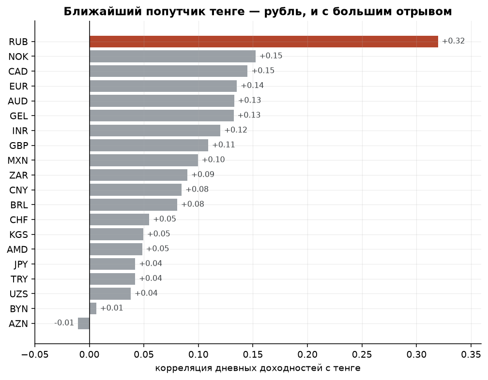
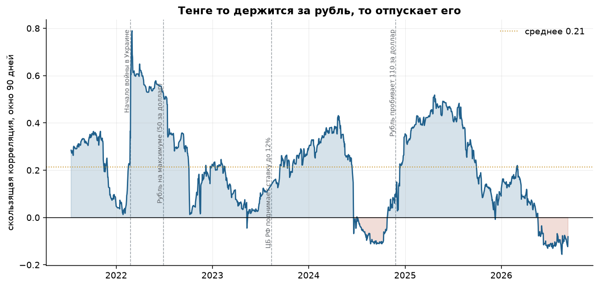
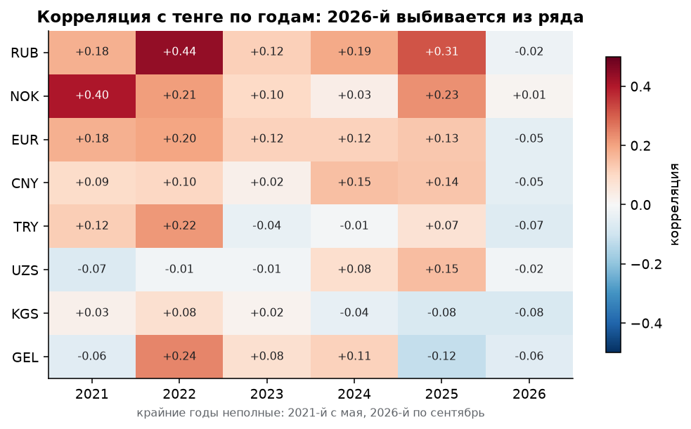
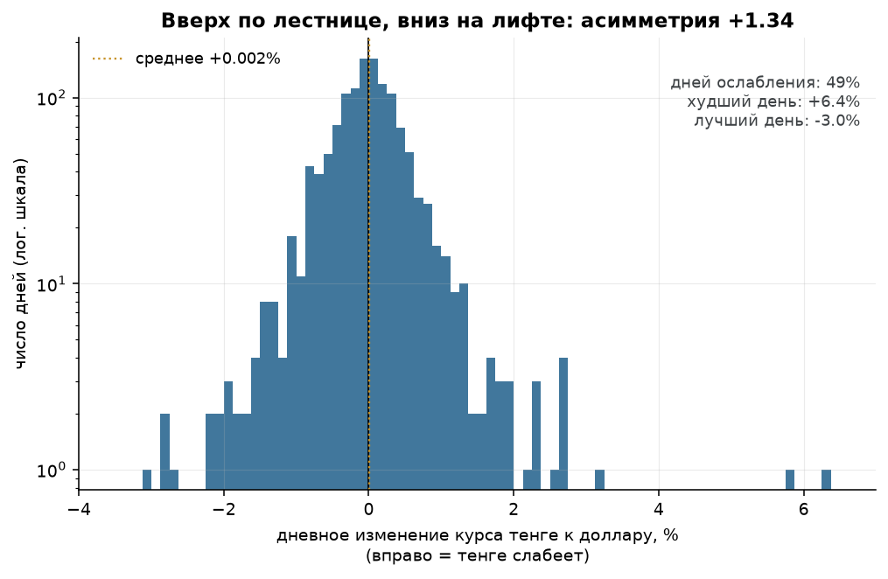
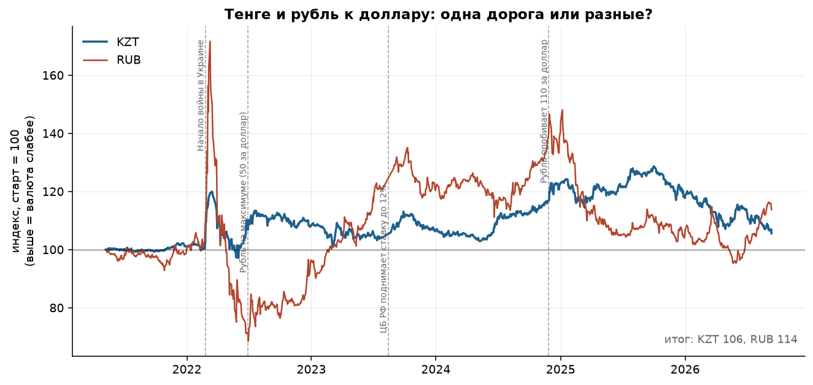
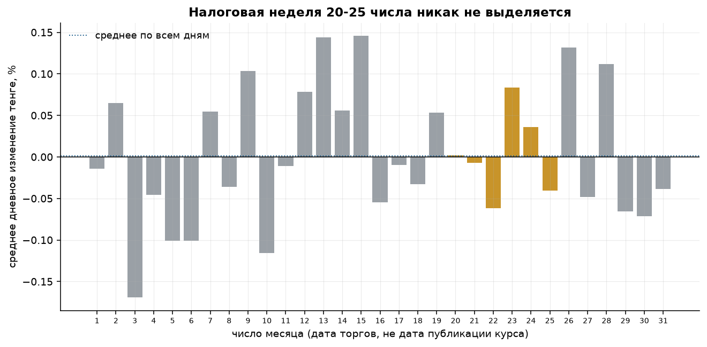

# С кем ходит тенге

Разбор официальных курсов Национального Банка РК за 8 мая 2021 — 11 сентября 2026.
1295 торговых дней, 48 котируемых валют.

---

## Вопрос

Про курс тенге в Казахстане говорят двумя способами сразу: «тенге идёт за рублём»
и «тенге идёт за нефтью». Обе версии звучат одинаково уверенно, обе обычно
остаются без цифры. А поскольку Нацбанк каждый рабочий день публикует курс сразу
к 47 валютам, проверить их можно прямо на его же данных:

**с какой валютой тенге на самом деле двигается в одну ногу, насколько сильно
и всегда ли?**

Побочно проверяются ещё две вещи: правда ли тенге падает резче, чем растёт,
и работает ли примета про «налоговую неделю».

---

## Данные

| | |
|---|---|
| Источник | Национальный Банк РК, открытый эндпоинт официальных курсов |
| Период | 08.05.2021 — 11.09.2026 |
| Гранулярность | один день, 48 валют |
| Сырых строк | 75 561 |
| После очистки | 1295 торговых дней |

Эндпоинт отдаёт по одному дню за запрос, поэтому загрузчик обходит 1960 дат
и кэширует ответы на диск. Архив у сервиса не бездонный: раньше начала мая
2021 года данных нет.

---

## Что пришлось починить в данных

**1. Курс публикуется не за одну единицу валюты.** Драм котируется за 10 штук,
узбекский сум — за 100, вьетнамский донг — за 1000. Без деления на кратность
сум оказывается дороже евро.

**2. Половина дней — не торговые.** В выходные и праздники Нацбанк не
устанавливает новый курс, а повторяет предыдущий. Казахстанские праздники
плавают и переносятся, поэтому такие дни отлавливаются не по календарю,
а по признаку: изменение ровно ноль сразу по всем валютам. Из 1922 дней
отсеялось 626.

**3. На даты вне архива сервис отдаёт не ошибку, а сегодняшний снимок курсов.**
Самая неприятная ловушка: строка выглядит совершенно нормальной. Ловится только
по тому, что совпадает с одним из последних дней выборки до шестого знака сразу
по десяткам валют.

**4. Дата курса — это не дата торгов.** Это выяснилось случайно, при попытке
посмотреть «день недели» тенге:

| Пн | Вт | Ср | Чт | Пт | Сб | Вс |
|---|---|---|---|---|---|---|
| 1 | 247 | 257 | 260 | 264 | 259 | 6 |

Понедельник — один день за пять лет, зато суббота полноценная. Объяснение
простое: курс, объявленный на дату D, посчитан по торгам дня D−1. «Субботний»
курс — это результат пятничных торгов, а «понедельничный» просто повторяет его.
На корреляции это не влияет (сдвинуты одинаково все валюты), но любые
календарные выводы без поправки считались бы не по тем дням.

В архиве, кстати, есть настоящая дыра: с 27 июля по 22 августа 2023 года данных
нет вообще. Доходности через такие разрывы не считаются.

---

## Вывод 1. Ближайший попутчик — рубль, но связь слабее, чем кажется



Корреляция дневных доходностей (все курсы предварительно пересчитаны в базу
доллара, иначе общий знаменатель-тенге создаёт связь на пустом месте):

| Валюта | Корреляция с тенге |
|---|---|
| **RUB** | **+0,32** |
| NOK | +0,15 |
| CAD | +0,15 |
| EUR | +0,14 |
| AUD | +0,13 |

Рубль впереди с двукратным отрывом — так что «тенге идёт за рублём» в целом
подтверждается. Но масштаб связи стоит назвать честно:

- рубль в одиночку объясняет **10,2%** дневной дисперсии тенге;
- все восемь валют-кандидатов вместе — **12,8%**;
- бета к рублю **0,137**: рубль падает на 10% — тенге на 1,4%.

То есть **почти 87% дневных движений тенге не объясняются мировыми валютами
вообще**. Это внутренняя история: интервенции, продажи валюты из Нацфонда,
спрос конкретных импортёров.

Отдельно проверено, нет ли сдвига на день (официальный курс считается по
вчерашним торгам, кросс-курсы берутся с мирового рынка). Максимум корреляции
приходится ровно на нулевой лаг, соседние втрое меньше — связь одновременная,
тенге не «догоняет рубль завтра».

---

## Вывод 2. Связь не постоянная, а хвостовая

Это главное, что ломает привычную формулировку.


| Движение рубля за день | Дней | Корреляция тенге с рублём |
|---|---|---|
| меньше 0,5% | 683 | +0,06 |
| 0,5–1% | 306 | +0,11 |
| 1–2% | 195 | +0,19 |
| **больше 2%** | **103** | **+0,55** |

В спокойные дни — а это больше половины выборки — связи нет вообще.
Она включается только в шторм.

**Тенге не привязан к рублю. Он его игнорирует ровно до тех пор, пока
не начинается паника.**

То же самое видно на скользящей корреляции: за пять лет она прошла путь
от +0,79 (март 2022) до −0,16 (август 2026) при среднем 0,21. Единого
«уровня связи» просто не существует.



---

## Вывод 3. Юань почти ни при чём

Китай — крупнейший торговый партнёр Казахстана, и интуитивно юань должен быть
где-то рядом с рублём. В рейтинге он одиннадцатый, корреляция **+0,085**.
В пошаговом отборе юань добавляет к объяснённой дисперсии **0,00%** — он весь
уже «зашит» в другие валюты.

Объём торговли и валютная связь — разные вещи. Расчёты по китайскому импорту
идут преимущественно в долларах, а юань сам по себе жёстко управляется
Народным банком Китая.

---

## Вывод 4. В 2026 году тенге отвязался от рубля



| Год | Корреляция с рублём |
|---|---|
| 2021 | +0,18 |
| 2022 | +0,44 |
| 2023 | +0,12 |
| 2024 | +0,19 |
| 2025 | +0,31 |
| **2026** | **−0,02** |

Впервые за пять лет связь уходит в ноль. Оговорка: 2026 год в выборке неполный
(170 торговых дней, январь–сентябрь), и корреляция на таком окне шумная.
Это повод следить дальше, а не готовый вывод.

---

## Вывод 5. Вверх по лестнице, вниз на лифте

Тенге принято считать вечно падающей валютой. В данных всё устроено тоньше.



- доля дней, когда тенге **слабел**: **49,4%** — то есть он чаще крепнет, чем слабеет;
- коэффициент асимметрии: **+1,34** (у юаня −0,62, у евро −0,42);
- худший день: **+6,4%**, лучший: **−3,0%**.

Средние по «дням вверх» и «дням вниз» почти одинаковы. Вся разница сидит
в хвосте — и её масштаб проще показать, чем описать:


| | |
|---|---|
| Всего дней | 1287 |
| Ослабление тенге за весь период | **+3,1%** |
| Вклад 10 худших дней | **+33,4%** |
| Итог без этих 10 дней | **−30,2%** |

**0,8% дней дают ослабление в десять раз больше итогового.** В остальное время
тенге медленно крепнет.

И эти десять дней — не случайный шум, а события: два крупнейших приходятся
на 24 и 28 февраля 2022 года (+6,4% и +5,8%), остальные группируются в три
коротких окна — ноябрь-декабрь 2024, апрель 2025 и апрель-июль 2026.

За весь период тенге ослаб к доллару на 5,6%, рубль — на 13,7%.
Для валюты с репутацией вечно падающей это неожиданно скромно.



---

## Вывод 6. Примета про налоговую неделю не подтверждается

Считается, что 20–25 числа экспортёры продают валютную выручку под налоговые
платежи, и тенге в эти дни крепче.



Проверено на торговых датах (с поправкой из пункта 4 про сдвиг), перестановочным
тестом на 20 000 итераций:

| | |
|---|---|
| Дней в налоговой неделе | 250 |
| Остальных дней | 1037 |
| Разница средних | −0,000001% |
| **p-value** | **0,999** |

Разница неотличима от нуля. Либо эффекта нет, либо он не доходит до
официального курса — например, потому что Нацбанк сглаживает именно такие
внутримесячные колебания.

---

## Что из этого следует практически

1. **Смотреть на рубль, чтобы предсказать тенге, имеет смысл только в шторм.**
   В спокойные дни это бесполезно: корреляция 0,06.
2. **Правило пересчёта на дни паники:** рубль на 10% → тенге примерно на 1,4%.
   За пределами таких дней правило не работает.
3. **Хеджировать тенге «в среднем» бессмысленно.** Риск сосредоточен
   в единичных днях, а не размазан по году.
4. **Юань — не прокси для тенге,** несмотря на структуру торговли.

---

## Ограничения

- Официальный курс Нацбанка — это средневзвешенная утренней сессии KASE,
  а не биржевой курс в реальном времени. Внутридневная динамика здесь не видна.
- Глубина архива — чуть больше пяти лет. Девальвации 2014 и 2015 годов
  в выборку не попали, а именно они сформировали общественные ожидания.
- Корреляция не доказывает причинность. Тенге и рубль могут двигаться вместе
  не потому, что один тянет другой, а потому что оба реагируют на нефть
  и на общий аппетит к риску развивающихся рынков.
- Нефть в анализе напрямую не участвует: нужны были только открытые данные РК.
  То, что вслед за рублём идут NOK и CAD, — косвенный аргумент за нефтяной
  канал, но не доказательство.
- В кросс-курсах мелких валют встречаются структурные разрывы: у белорусского
  рубля 8 июля 2022 и 3 октября 2023 котировка Нацбанка меняется скачком
  на 25–30% за день. В основные выводы эти валюты не входят.

---

## Как воспроизвести

```bash
pip install -r requirements.txt
python -m src.fetch_nbk     # ~5 минут, дальше работает из кэша
python -m src.pipeline      # таблицы в reports/tables, графики в reports/figures
pytest
```
